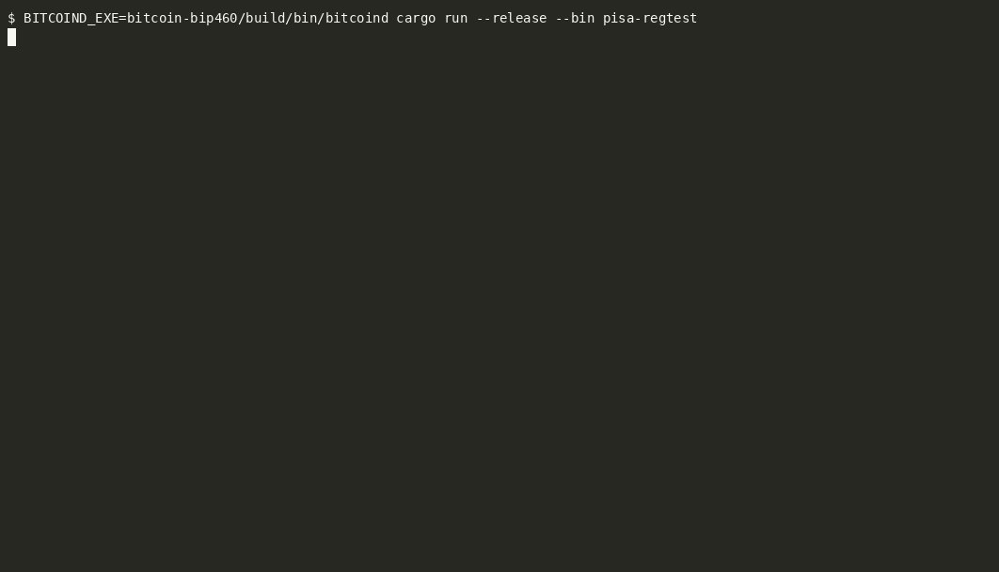
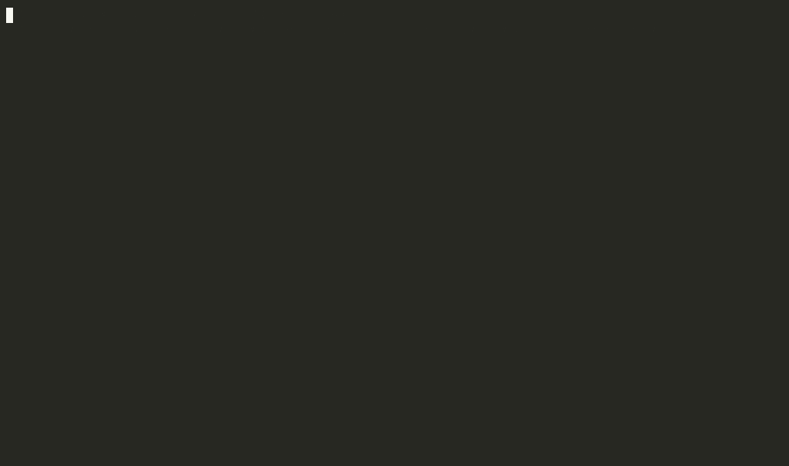
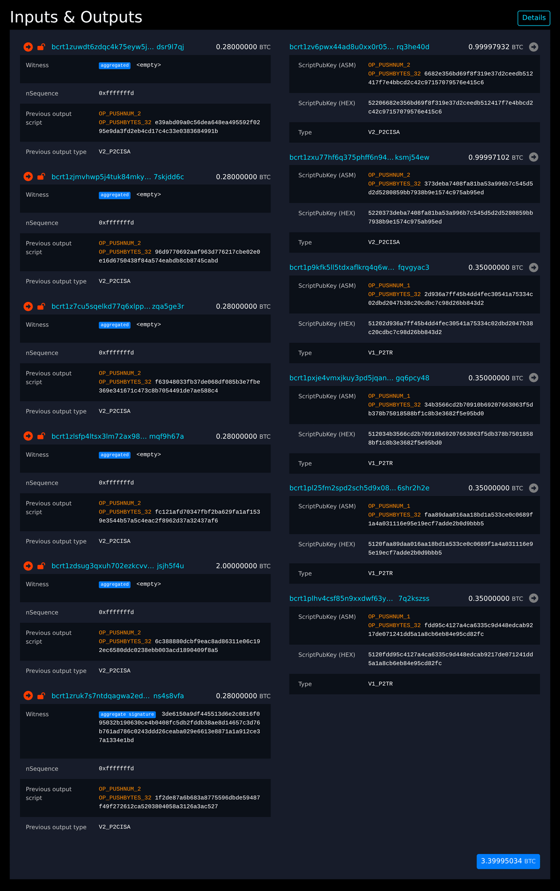

# pisa

Async payjoin with cross-input signature aggregation.

A BIP 77 payjoin between two parties whose witness version 2 inputs form one
BIP 460 full-aggregation group, so the transaction carries one 64-byte
signature for both. No message is added to BIP 77. The sender's original
PSBT carries its public nonce, the receiver's proposal carries the receiver's
nonce and partial signature, and the sender finishes the signature before it
broadcasts.

This is a prototype. It runs on regtest against a build of Bitcoin Core that
validates BIP 460, and it depends on a branch of the payjoin crate that lets
the aggregation fields through. Nothing here is ready for real coins.

## What it does

`cargo run --bin pisa-regtest` starts a private regtest node, funds a sender
and a receiver wallet with witness version 2 coins, runs a payjoin between
them through an in-process payjoin directory and OHTTP relay, mines the
result, and prints it. The transaction has two inputs. One carries an empty
witness, the other a 65-byte witness with the aggregate signature and the
BIP 460 marker.



The run narrates each step: which PSBT fields each message carries, the
final witness sizes, and the node's confirmation. `docs/demo.cast` is the
same recording for `asciinema play`. Set `RUST_LOG` to see the payjoin
crate's own logging underneath.

The same run is the end-to-end test:

```sh
BITCOIND_EXE=/path/to/bitcoind cargo test --test regtest -- --include-ignored
```

## Where it saves money

A group of n inputs carries one signature instead of n, which is 64 weight
units, about 16 vB, for every input beyond the group's last. Two inputs save
16 vB. The saving is worth something where a transaction has many inputs,
and payjoin is how one party's many inputs end up in another party's
transaction.

`cargo run --bin pisa-regtest -- --cut-through` runs that case. A customer
deposits 1 BTC to an exchange which has four withdrawals pending. Rather
than hold the deposit in an output of its own and pay the withdrawals from a
later batch, the exchange puts the four withdrawal outputs into the deposit
transaction and covers the difference with five coins of its own. All six
witness version 2 inputs form one group.



```
                                                   vB  fee at 10 sat/vB
  no payjoin: deposit, then a batch   computed    725              7250
  payjoin, every input signed         measured    614              6140
  payjoin, one aggregate signature    measured    534              5340
```

The first row is the pair of transactions an exchange without payjoin makes:
the deposit, and a batch that spends it together with the five coins. The
demo does not build them, so that row is computed from BIP 341 weights in
`src/cost.rs`. The other two are mined transactions. The run builds the same
cut-through twice, once with the exchange's coins in the group and once with
each of them signed on its own, so the row a reader is most likely to doubt
is measured rather than asserted.

The run prints who paid, too. BIP 78 has the customer cover the transaction
it would have made alone plus the contribution it offered, and the receiver
cover the rest of its inputs and all of the outputs it added. Of the 4966
sat fee that is 2068 sat and 2898 sat. `--withdrawals`, `--top-up` and
`--fee-rate` change the scenario; `docs/cutthrough.cast` is the recording
above for `asciinema play`.

## In a block explorer

With `PISA_KEEP_NODE=1` the node stays up after the run and the binary
prints its RPC URL and cookie file, so a block explorer can be pointed at
it. The `cisa-witness-v2` branch of
[bitcoin-pisa/mempool](https://github.com/bitcoin-pisa/mempool/tree/cisa-witness-v2)
renders the cut-through like this, with `MEMPOOL.BACKEND` set to `none` and
`CORE_RPC` set to that node. Five of the six inputs carry an empty witness;
the sixth carries the signature for all of them.



## Requirements

- Rust 1.85 or later.
- A Bitcoin Core built from the `bip460` branch of
  [fjahr/bitcoin](https://github.com/fjahr/bitcoin/tree/bip460). The commit
  this prototype was run against is pinned in `.github/workflows/ci.yml`.
  Release builds of Bitcoin Core treat witness version 2 as anyone-can-spend
  and have no `cisa()` descriptor, so they cannot take part.

```sh
git clone https://github.com/fjahr/bitcoin -b bip460
cmake -S bitcoin -B bitcoin/build -DBUILD_TESTS=OFF -DBUILD_GUI=OFF
cmake --build bitcoin/build -j"$(nproc)"
export BITCOIND_EXE="$PWD/bitcoin/build/bin/bitcoind"
```

The payjoin crate comes from a git submodule, so clone with
`--recurse-submodules` or run `git submodule update --init` afterwards.

## How the pieces fit

The aggregation itself lives in the wallet. Bitcoin Core's branch reserves a
nonce for one of its own witness version 2 outputs before the spending
transaction exists (`reservecisanonce`), signs an input that carries such a
nonce in one `walletprocesspsbt` call, and aggregates the group once every
partial signature is present. This crate never sees a secret nonce.

What this crate does is decide which inputs join the group and carry the
PSBT fields of the draft "CISA Fields for PSBT" between the two parties:

- `src/wallet.rs` defines the seam, the `AggregatingWallet` trait, and
  implements it over Bitcoin Core's RPC.
- `src/sender.rs` declares the sender's inputs for aggregation on the signed
  fallback PSBT before it leaves.
- `src/receiver.rs` contributes the receiver's coins as members of the
  group, each with a nonce reserved on the spot.
- `src/regtest.rs` drives both scenarios end to end.
- `src/cost.rs` holds the weights the comparison is built from.

The payjoin crate had to change in four places for this to work; see
`docs/bip77-full-aggregation.md` for the protocol profile and for what the
implementation changed about it.

## License

The code is licensed under either the MIT license or the Apache License 2.0,
at your option. The documents under `docs/` are dedicated to the public
domain under CC0 1.0.
